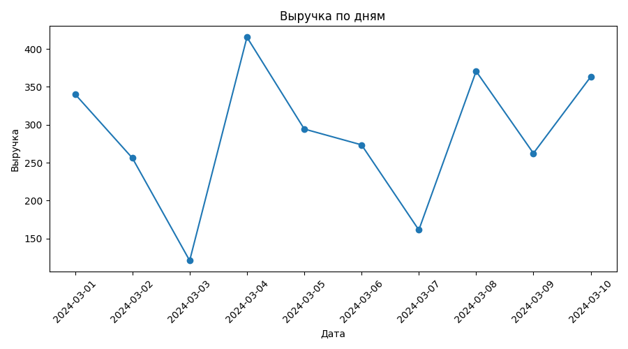
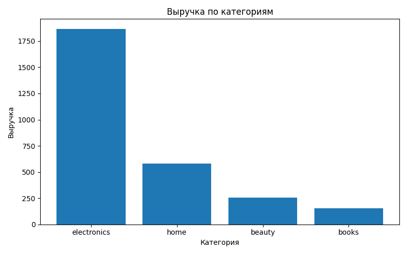

# Анализ заказов интернет-магазина

Небольшой анализ заказов интернет-магазина. В проекте считаются основные метрики продаж, проверяется простая A/B-гипотеза по конверсии и строятся графики.

## Что внутри

- `orders.csv` — данные по заказам и пользователям
- `analysis.py` — расчёт метрик, A/B-тест и визуализация
- `figures/` — папка, куда сохраняются графики после запуска

## Что считается

- выручка по дням
- количество заказов по категориям
- средний чек
- конверсия в группах A и B
- z-тест для сравнения конверсий

## Как запустить

```bash
python analysis.py
```

Для запуска нужны `pandas` и `matplotlib`.

## Результаты



